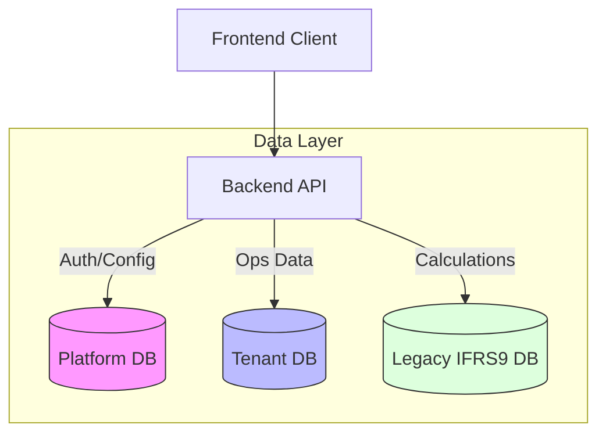

# ADR-001: Hybrid Multi-Tenant Database Architecture

**Date:** 2026-02-01  
**Status:** Accepted  

## Context
The application serves multiple tenants (banks/financial institutions) who require strict data isolation. However, there are shared services (Platform Admin) and a legacy IFRS9 calculation engine that must be integrated. The challenge is to architect a database strategy that balances isolation, shared management, and legacy interoperability.

## Decision
We will adopt a **Hybrid Multi-Tenant Architecture** consisting of three distinct database roles:

1.  **Platform Database**: Centralized database for managing tenant registration, user authentication (global), and system-wide configurations.
2.  **Tenant Database**: Separate database (or isolated schema) per tenant for operational data including Jobs, Workflows, and Application Data.
3.  **Legacy Database**: Direct connection to the existing IFRS9 Engine database for executing heavy stored procedures and calculations.

## Architecture

## Consequences

### Positive
*   **Strong Isolation**: Operational data is strictly segregated per tenant.
*   **Legacy Reuse**: Existing IFRS9 stored procedures can be triggered directly without migration.
*   **Central Management**: Users and roles are managed centrally.

### Negative
*   **Complexity**: Backend must manage multiple connection pools (Platform, Tenant, Legacy).
*   **Consistency**: Cross-database transactions are not supported; we must reply on application-level consistency (Saga pattern or eventual consistency).
