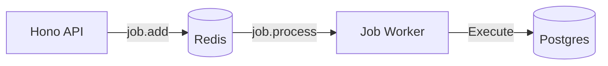

# Backend Architecture

**Stack:** Node.js, Hono, Drizzle ORM, BullMQ, PostgreSQL, Redis.

## 1. Modular Architecture (NestJS-style)
Although using Hono for its lightweight performance, we adopt a layered architecture inspired by NestJS to maintain separation of concerns:
*   **Routes (`/routes`)**: Define API endpoints and validation schemas (Zod).
*   **Services (`/services`)**: Contain business logic (e.g., `JobExecutorService`, `QueueService`).
*   **Database (`/db`)**: Drizzle ORM schemas and connection logic.

## 2. Database Strategy
See [ADR-001](../adr/001-multi-tenant-db.md) for the multi-tenant strategy.
*   **Platform DB**: Global user/tenant management.
*   **Tenant DB**: Isolated operational data (Jobs, Workflows).
*   **Legacy DB**: Direct link to IFRS9 calculation engine.

## 3. Asynchronous Processing (BullMQ)
We use BullMQ for reliable background job execution.
*   **Producer**: `queue.service.ts` adds jobs to the `ifrs9-jobs` queue.
*   **Consumer**: A dedicated worker process picks up jobs.
*   **Router**: The worker determines the target DB (Tenant vs Legacy) and dispatches to the correct executor.

## 4. Security & Access Control
- [RBAC Technical Design](./rbac-technical-design)
- Related FSD: [RBAC Access Control](../fsd/rbac-access-control)

## 5. Schema Artifacts
- [DBML Schema Reference](./dbml-schema-reference)
- [DBDocs Publishing Runbook](./dbdocs-publishing-runbook)

