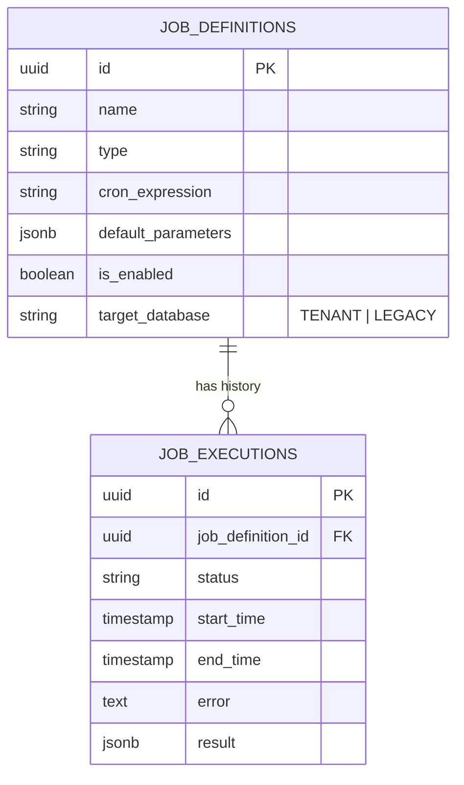
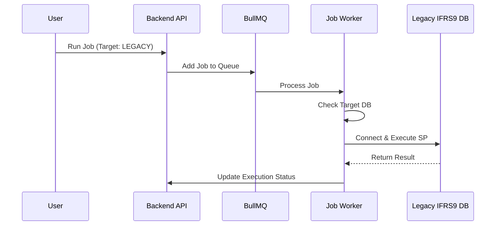

# FSD: Job Monitoring & Execution System

**Version:** 1.0  
**Last Updated:** 2026-02-01

## 1. Overview
The Job Monitoring System provides a unified interface for scheduling, executing, and tracking background tasks. It abstracts the underlying execution environment (Stored Procedures, Shell Scripts, Internal Handlers) and supports execution on both the Tenant DB and the Legacy IFRS9 Engine.

## 2. Functional Requirements

### 2.1 Job Creation
*   **Dynamic Forms**: The UI must adapt input fields based on the selected `Job Type`.
    *   *SQL_SP*: Requires `Schema Name`, `Procedure Name`, and `Target Database`.
    *   *INTERNAL_SCRIPT*: Requires `Handler Name`.
    *   *SHELL_COMMAND*: Requires `Command`.
*   **Target Database**: Users must be able to select between `TENANT` (default) and `LEGACY` databases for Stored Procedure jobs.
*   **Scheduling**: Support for standard Cron expressions.

### 2.2 Job Execution
*   **Immediate Execution**: "Run Now" button to trigger jobs on demand.
*   **Parameter Passing**: Jobs accept a JSON object of parameters which are passed to the underlying executor.
*   **Status Tracking**: Real-time tracking of job status (`QUEUED`, `RUNNING`, `COMPLETED`, `FAILED`).

## 3. Data Model

## 4. Sequence Diagram: Legacy Job Execution

