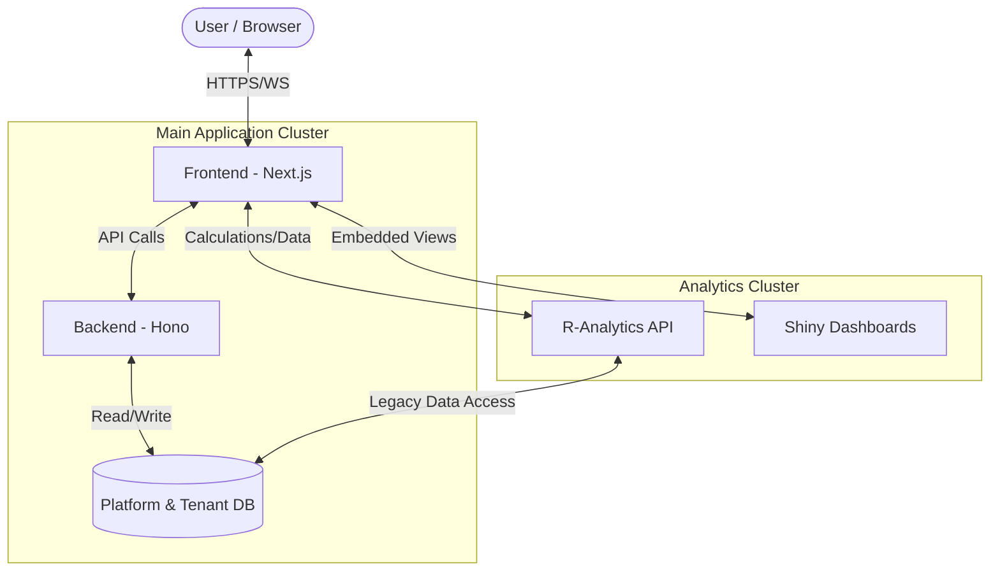

# System Architecture

The IFRS9 IAF system is built on a modular architecture that separates concerns between the user interface, business logic, and heavy-duty analytical computations.

## Overview

The system consists of three primary services:
1.  **Frontend**: A Next.js application representing the user dashboard.
2.  **Backend**: A Hono/Node.js service managing authentication, multi-tenancy, and business workflows.
3.  **R-Analytics**: A specialized R Plumber API handling specialized IFRS9 calculations and reporting.

## System Interaction Flow

The following diagram visualizes how the components interact during a typical analytical session.

## Data Layer
The system uses a **PostgreSQL** database with multiple schemas:
- `platform_admin`: Global system settings and tenant management.
- `public`: Shared legacy tables.
- `core`, `auth`, `approval`: Tenant-specific operational tables.

## Deployment
All services are containerized using **Docker** and deployed via **Dokploy**. Technical documentation is hosted on **Firebase Hosting**.
