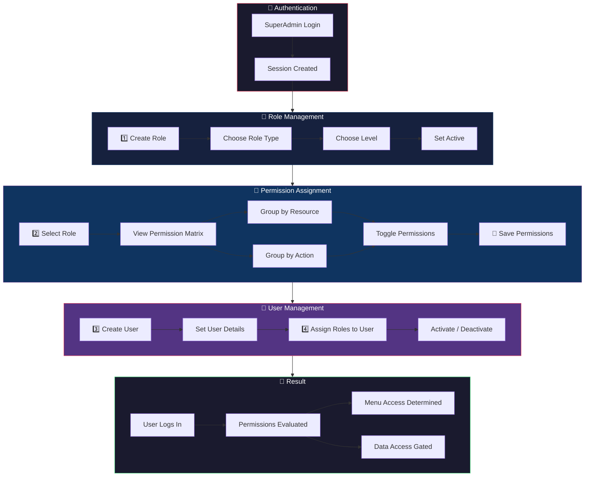
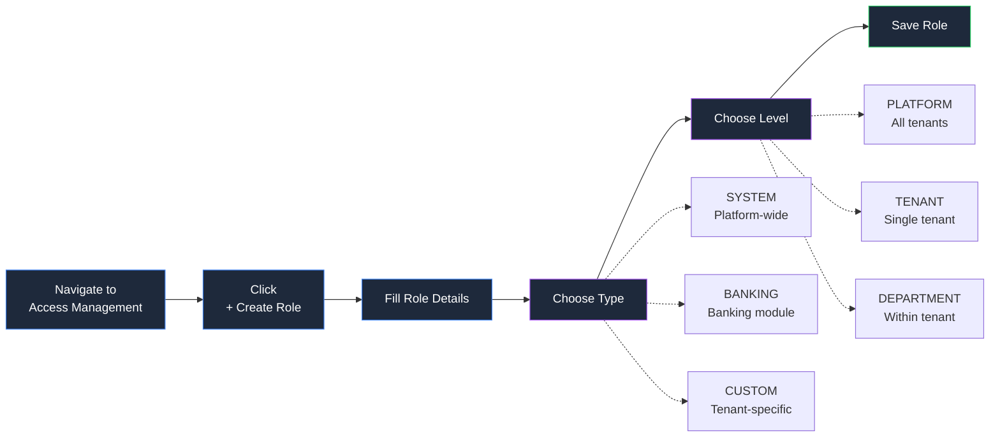
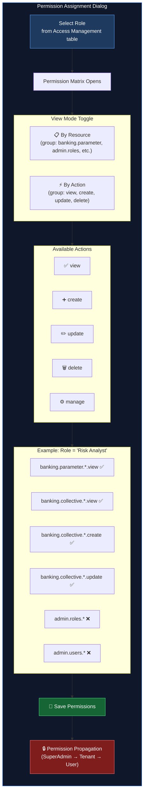
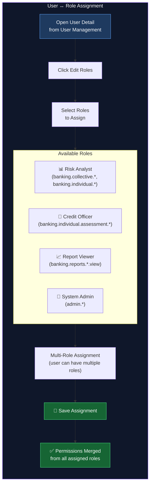
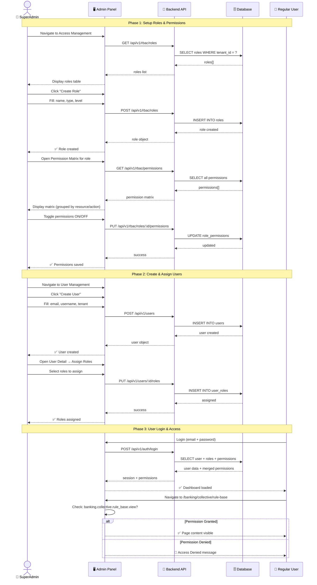
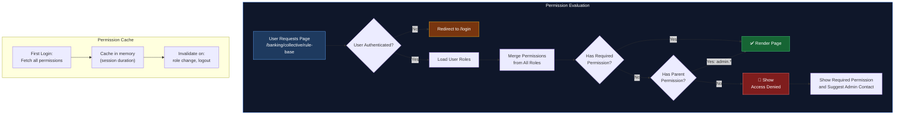
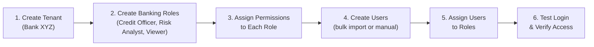
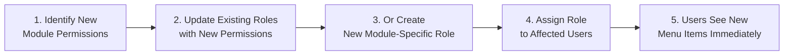
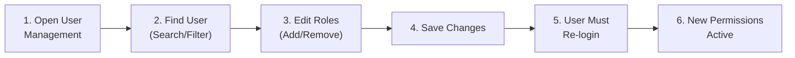

# SuperAdmin RBAC Guide

This guide covers the complete workflow for SuperAdmins to set up and manage access control in the IFRS9 Platform.

## System Overview

---

## Step-by-Step Workflows

### 1️⃣ Creating a Role

**Role Types:**

| Type | Description | Example |
|------|-------------|---------|
| `SYSTEM` | Platform-wide, cannot be deleted | SuperAdmin, Platform Admin |
| `BANKING` | Banking module roles | Risk Analyst, Credit Officer |
| `CUSTOM` | Tenant-specific custom roles | Regional Manager, Auditor |

**Role Levels:**

| Level | Scope | Visibility |
|-------|-------|------------|
| `PLATFORM` | All tenants | Platform admin only |
| `TENANT` | Single tenant | Tenant admin |
| `DEPARTMENT` | Within tenant | Department head |

---

### 2️⃣ Assigning Permissions to a Role

**Permission Format:** `<module>.<resource>.<scope>.<action>`

**Examples:**

| Permission | Meaning |
|------------|---------|
| `banking.parameter.product.view` | Can view product parameters |
| `banking.collective.rule_base.create` | Can create rule base configs |
| `admin.roles.manage` | Full role management access |
| `admin.users.*` | All user management actions |
| `banking.dashboard.view` | Can view banking dashboard |

---

### 3️⃣ Creating a User

```mermaid
flowchart LR
    A["Navigate to\nUser Management"] --> B["Click\n+ Create User"]
    B --> C["Enter Email"]
    C --> D["Set Username"]
    D --> E["Set Password\n(or send invite)"]
    E --> F["Select Tenant"]
    F --> G["Assign Initial Role"]
    G --> H["Activate User"]

    style A fill:#1e293b,stroke:#3b82f6,color:#fff
    style B fill:#1e293b,stroke:#3b82f6,color:#fff
    style C fill:#1e293b,stroke:#a855f7,color:#fff
    style D fill:#1e293b,stroke:#a855f7,color:#fff
    style E fill:#1e293b,stroke:#a855f7,color:#fff
    style F fill:#1e293b,stroke:#f59e0b,color:#fff
    style G fill:#1e293b,stroke:#f59e0b,color:#fff
    style H fill:#1e293b,stroke:#22c55e,color:#fff
```

---

### 4️⃣ Assigning Users to Roles

---

## Complete RBAC Lifecycle

---

## Permission Evaluation Flow

---

## Common Scenarios

### Scenario 1: New Bank Onboarding

### Scenario 2: Add New Module Access

### Scenario 3: User Role Change

---

## Access Management Screens

| Screen | Path | Description |
|--------|------|-------------|
| Access Management | `/banking/maintenance/access-management` | Main RBAC dashboard with tabs |
| Roles Tab | `/banking/maintenance/access-management/roles` | Role CRUD + permission matrix |
| Role Detail | `/banking/maintenance/access-management/roles/[roleId]` | Single role detail + permission editor |
| Users Tab | `/banking/maintenance/access-management` (Users tab) | User list with role assignment |
| Review Tab | `/banking/maintenance/access-management` (Review tab) | Access review + audit |
| Platform RBAC | `/platform/rbac` | Platform-level RBAC (all tenants) |

---

## Best Practices

1. **Principle of Least Privilege** — Grant minimum permissions needed
2. **Role Naming** — Use clear, descriptive names: `Risk Analyst`, `Credit Officer`, `Report Viewer`
3. **Avoid Custom Per-User Roles** — Assign users to shared roles instead
4. **Regular Access Reviews** — Use the Review tab to audit permissions quarterly
5. **Hierarchy Awareness** — `PLATFORM` level roles override `TENANT` level
6. **Multi-Role Users** — Users with multiple roles get merged (union) permissions
7. **System Roles** — Never delete `SYSTEM` type roles (SuperAdmin, Platform Admin)
8. **Testing** — After changes, login as a test user to verify access is correct
